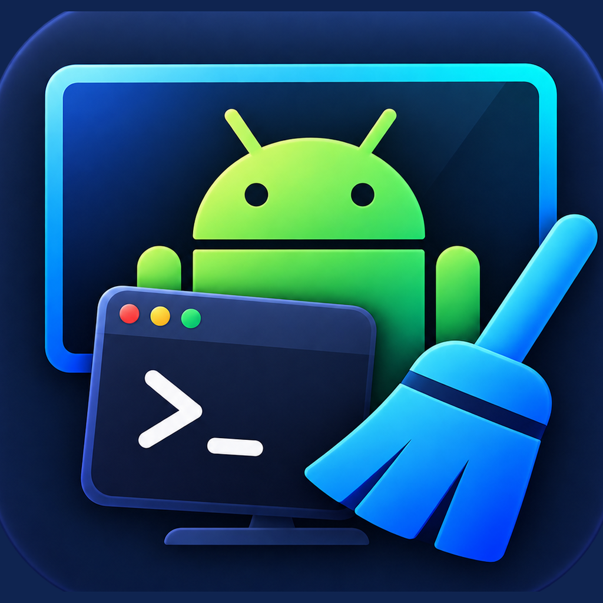

<p align="center">
  
</p>

<h1 align="center">ADBroom</h1>

<p align="center">
  ADBroom: Android TV'nizi Mac'te debloat (temizleme) uygulaması<br>
  <a href="README.md">English</a> · <b>Türkçe</b>
</p>

> [!NOTE]
> ADBroom, [Mert Çobanov](https://cobanov.dev)'un [Clean up your Android TV](https://tv.cobanov.dev/) projesinin uygulama halidir. Uygulama yerine terminalde ilerlemeyi tercih edersen, rehberi ve promptları izleyerek aynı sonuca ulaşabilirsin.

## Özellikler

- **Kumanda:** yön tuşları, ses, kanal, Kaynak, Ayarlar, medya tuşları, metin gönderme, açma/kapatma.
- **Ekran:** TV'yi sesli ve görüntülü izleme ([scrcpy](https://github.com/Genymobile/scrcpy) ile), ekran görüntüsü.
- **Uygulamalar:** listeleme, açma, durdurma.
- **Paketler:** paketleri kapatma ve geri açma. Asla silmez. Kritik paketler kilitlidir.
- **Sistem:** RAM ve depolama bilgisi, önbellek temizleme, animasyon hızı, yeniden başlatma.
- Türkçe / English.

Android TV, Google TV ve Fire TV ile çalışır.

## Kurulum

macOS 14+ gerekir (Apple Silicon veya Intel).

1. Araçları kur:
   ```sh
   brew install android-platform-tools scrcpy
   ```
2. [Releases](../../releases) sayfasından DMG'yi indir, **ADBroom**'u **Uygulamalar**'a sürükle.
3. Uygulama notarize değil. İlk açılışta: **Sistem Ayarları → Gizlilik ve Güvenlik → Yine de Aç**.

## TV'yi hazırla (bir kez)

1. **Ayarlar → Cihaz Tercihleri → Hakkında:** **Derleme / Build** satırına 7 kez bas.
2. **Geliştirici seçenekleri:** **USB hata ayıklama**'yı aç (veya **Ağ / Kablosuz hata ayıklama**).
3. **Ayarlar → Ağ ve İnternet:** TV'nin IP adresini not al. Mac ile TV aynı ağda olmalı.
4. ADBroom'da IP'yi yaz ve **Bağlan**'a bas. TV'de **Her zaman izin ver** ve **İzin ver**'i seç.

TV eşleştirme kodu isterse (Android 11+ Kablosuz hata ayıklama), ADBroom'da **Eşleştir…**'e bas, TV'deki `IP:bağlantı noktası` ve kodu gir, sonra Kablosuz hata ayıklama ekranındaki `IP:bağlantı noktası` ile bağlan.

## Paketler

- ADBroom yalnızca `pm disable-user --user 0` kullanır. Her şey `pm enable` ile geri gelir.
- Ana ekran, klavye, TV girişleri, Kaynak tuşu, kumanda ve Play Servisleri kilitlidir.
- Birkaç paket kapat, TV'yi test et. Bir şey bozulursa **Geri aç** veya **Tümünü geri al**.

Uygulama olmadan geri almak için:

```sh
adb connect <TV-IP>:5555
adb shell pm enable <paket>
```

## Sınırlar

- Anten, HDMI ve DRM'li içerik (Netflix, Prime…) izleme penceresinde siyah görünür.
- Donanımsal video kodlayıcısı olmayan TV'lerde izleme takılabilir. Düşük kaliteyi kullan.
- Derin uykudan açma, TV'nin Wake-on-LAN desteğine bağlıdır.

## Derleme

```sh
./build.sh          # build/ADBroom.app
./build.sh --dmg    # build/ADBroom-x.y.z.dmg
```

Xcode veya Command Line Tools gerekir.

## Teşekkürler

- [Mert Çobanov](https://cobanov.dev): [Clean up your Android TV](https://tv.cobanov.dev/)
- [scrcpy](https://github.com/Genymobile/scrcpy)

## Lisans

[MIT](LICENSE). Kullanım sorumluluğu sana aittir. Google veya herhangi bir TV üreticisiyle bağlantılı değildir. Android, Google LLC'nin ticari markasıdır. Android robotu, Google tarafından oluşturulup paylaşılan çalışmadan çoğaltılmış veya değiştirilmiştir ve [Creative Commons 3.0 Atıf Lisansı](https://creativecommons.org/licenses/by/3.0/deed.tr) koşullarına göre kullanılmaktadır.
